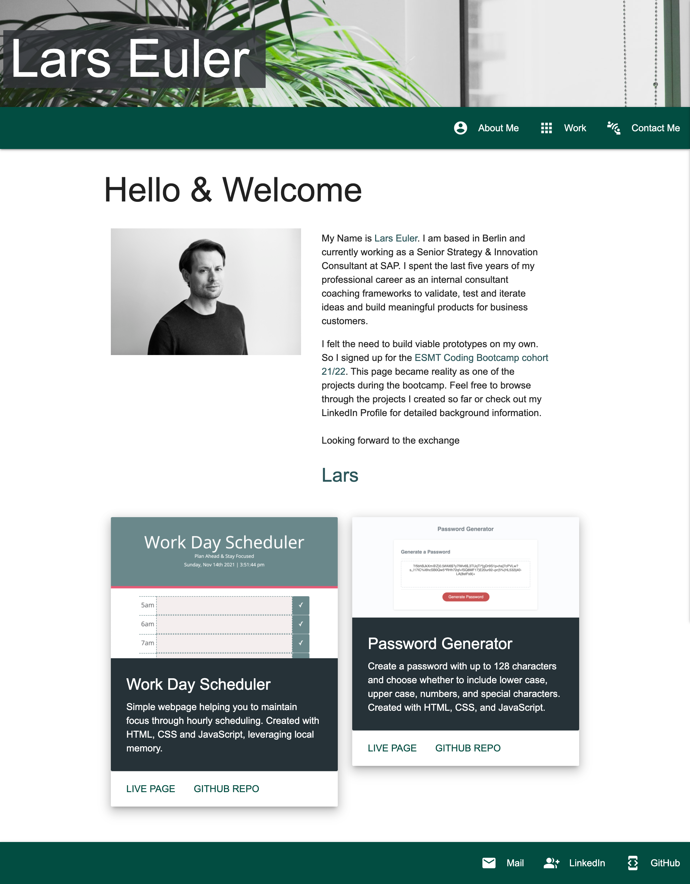
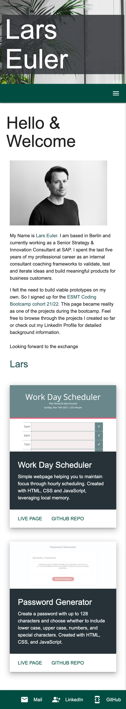

# Homework02Portfolio

Updated Portfolio Page that showcases two of the assignments made in phase 1 of the bootcamp

# Links to the files

- [GitHub Repository](https://github.com/laeuler/Homework02Portfolio)
- [GitHub Page](https://laeuler.github.io/personal-portfolio-page/)

# Contributors

- Lars Euler: https://github.com/laeuler

# Technologies used

- HTML
- CSS, Materialize.css
- JavaScript, jQuery

# Mock-Up

The following image shows the web application's appearance and functionality:
Screenshotted with Google Chrome

Screen capture shown below made with Chrome Extension Go Full Page.

# Desktop View

# Mobile First Design

# Closing Remarks

Looking forward to the feedback to learn more.
Lars

# License

